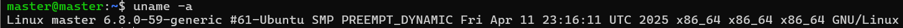
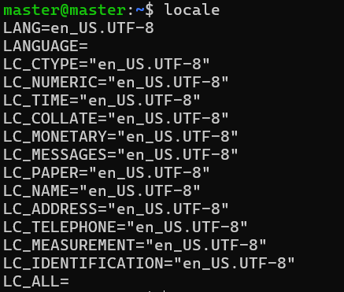
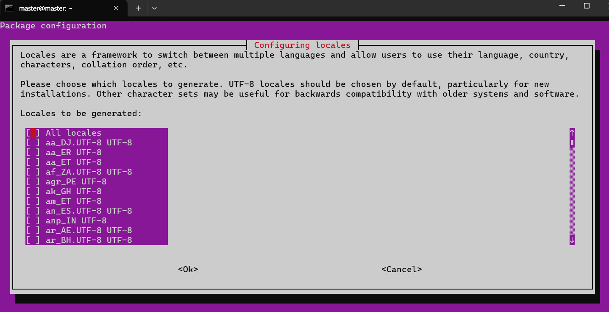
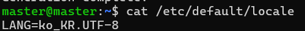

# history : 명령어 수행 내용 출력

`!!` : 직전 명령을 재실행
`!번호` : 번호에 해당하는 명령을 재실행
`!문자열` : 문자열로 시작하는 마지막 명령을 재실행
`history -d 라인번호` : 라인번호에 해당하는 명령어를 삭제
`history -c` : 명령어 전체 삭제

--------------------------------------------------------

# --help와 man

--help 옵션을 이용하면 도움말을 출력

```shell
man [옵션][section] 명령어
```

--------------------------------------------------------

# shell이 명령어를 찾는 순서

```shell
echo $PATH
```

--------------------------------------------------------

# whereis : 명령어 위치 확인 
> 왜 필요한가? 설치한 프로그램의 명령어 위치 확인하기 위함 

```shell
whereis [옵션] [명령]
```
## 옵션
b : 바이너리 파일만 검색
m : 메뉴얼만 검색
s : 소스 파일만 검색 

--------------------------------------------------------

# which : path에 기록된 디렉토리에서 명령어의 위치 검색 
```shell
which [옵션][명령어]
```
## 옵션
-a, --all : 모든 내용을 출력 

--------------------------------------------------------

# 기본 명령어 
- passwd : 비밀번호 변경
- exit : 터미널 종료, 원격 접속인 경우 접속이 해제됨 
- clear : 현재 보이는 화면 삭제  
- 별명 : 
    `alias 별명 = '실제값'`
    - 예시 : ls -F 라는 명령을 ls로 설정
        - alias ls = 'ls -F'
    - `type 명령어`를 이용하면 별명인지 확인 가능 
    - unalias를 이용하면 별명 삭제 가능 

- 원본 명령어 실행 : 전체 경로로 명령어를 실행
    - `command 명령어 \명령어`

# 날짜와 시간 관련 명령어
> Locale이 안 맞으면 프로그램이 설치가 안 되는 경우도 있기 때문에 
    - date 
    - timedatectl

# 시스템 사용자 정보
- logname : 현재 사용 중인 계정 확인
- users : 접속한 사용자읙 계정 확인
- who : 로그인 한 모든 사용자 계정 확인
- whoami : 현재 ubuntu 사용자 확인 

--------------------------------------------------------

# 시스템 정보 
```shell
uname [옵션]
```

## 옵션
a : 시스템의 모든 정보 확인   
m : 하드웨어 정보 확인 (CPU 아키텍처)   
n : 호스트 네임    
r : 운영체제 릴리즈 번호 (커널 버전)
s : 운영체제 이름   
v : 버전 출시 일자   



```shell
hostname # 호스트 이름
arch # 아키텍처 
env # 환경변수
```

--------------------------------------------------------

# sudo 와 su
- `sudo` : 관리자의 권한을 빌려서 명령을 실행하는 것으로 관리자 비밀번호를 입력해야 함   
- `su 계정` : 현재 계정의 환경 변수들을 유지하면서 다른 계정으로 전환   
- `su -계정` : 새로운 계정의 환경 변수들을 유지하면서 다른 계정으로 전환  
- `su` : root로 전환   

--------------------------------------------------------

# 추가 설정

## 1) 로케일 설정 
#### 1.1) 현재 로케일 확인 : `locale` 
#### 1.2) 로케일 수정



```shell
sudo apt install language-pack-ko
sudo update-locale LANG=ko_KR.UTF-8
sudo dpkg-reconfigure locales # 명령 후 ko_KR.UTF-8을 선택 
```


#### 1.3) 변경된 Default 로케일 확인


#### 1.4) GUI 설치
```shell
sudo apt update
sudo apt install ubuntu-desktop
```

--------------------------------------------------------

> 발생했던 에러 
- 에러 메시지 : Waiting for cache lock: Could not get lock /var/lib/dpkg/lock-frontend. It is held by process 430501 (apt)
- 해결 방안 : 락 걸린 거임, 프로세스 kill했었음


