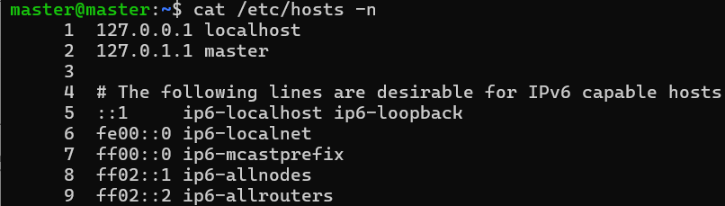
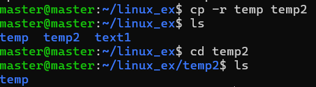
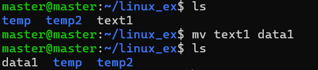
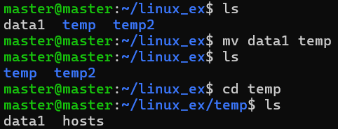
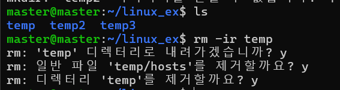
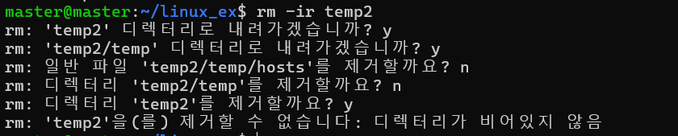
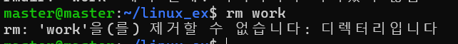

# 파일 관련 명령
## 파일 내용 출력 : `cat [옵션][파일]`
- 옵션 : n은 라인 번호를 같이 출력 
- 예시 : `cat /etc/hosts`
    

## 파일의 내용을 화면 단위로 출력 : `more [옵션][파일]`
- 옵션 : +행번호 형태로 설정하여 시작할 행 번호를 설정
    - 화면 출력 후 Enter를 누르면 한 행씩 이동하고 spacebar를 누르면 화면 단위로 이동 
- 예시 : `more /etc/services`


## 파일의 내용을 화면 단위로 출력 : `less [파일]`
- 화면 이동 키는 vi 편집기와 동일 
    - j : 한 행 아래로
    - k : 한 행 위로
    - spacebar : 다음 화면으로
    - CTRL + b : 이전 화면으로 

> cat과 more과 less의 차이점 ?
cat은 무한 스크롤. more, less은 페이지네이션. less는 vi편집기.

## 파일의 내용 뒷 부분을 출력 : `tail [옵션][파일]`
- 옵션
    - +행번호 : 지정한 행부터 끝까지 출력
    - -숫자 : 화면에 출력 행의 수를 지정 (기본은 10)
    - f : 파일 출력을 종료하지 않고 주기적으로 계속 출력

### ex) /etc/services 파일의 하단 50줄을 출력 : `more 50 /etc/services`
- f 옵션을 이용하면 종료되지 않고 계속 출력 대기 중인데 이 옵션을 사용하는 경우는 로그를 확인할 때 사용됩니다
    - 새로운 내용이 추가될 때마다 화면에 출력되기 때문에 로깅에서는 매우 유용한 옵션이다 

### ex) /etc/services 파일의 내용을 화면 단위로 출력 : `less /etc/services`
- 다음 페이지 보기 : space bar
- 이전 내용 보기 : k 
- 검색 : /검색할내용
- n을 눌러서 다음 내용으로 이동
- 종료 : q 

### ex) more 명령으로 /etc/services 파일을 출력
- HTTP 검색
- 다른 곳에도 있는지 확인
- more 명령 종료 

### ex) cp 명령으로 파일을 복사하는 명령
- 형식 : `cp [옵션][파일1이나 디렉토리1][파일2이나 디렉토리2]`
- 옵션
    - i : 파일2가 존재하는 경우 덮어씌울지 물어보는 옵션
    - r : 디렉토리 복사 

### 일반적인 파일 복사 : /etc/hosts 파일을 text1파일로 복사  
- `cp /etc/hosts text1`
- `ls`

### 디렉토리로 복사 
```shell
mkdir temp
cp text temp
ls temp
```

### 새로운 이름으로 복사 
```shell
cp text1 temp/text2
```

### 여러 개의 파일을 특정 디렉토리로 복사 가능
- 여러 개의 파일을 지정할 때는 마지막이 디렉토리여야 합니다 
    - `cp [파일...] [디렉토리]`
```shell
cp /etc/hosts /etc/services temp
```

- i옵션 : 덮어쓰기
```shell
cp -i /etc/hosts text1
```

- 디렉토리 복사 
```shell
cp -r temp temp2
```

- 기존에 존재하는 디렉토리에 복사하게 되면 하위 디렉토리로 만들어 집니다
```shell
cp -r temp temp2
```



## 파일 이동과 이름 변경 : `mv 명령어` 
- 기본 형식 : `mv [옵션] [파일이나 디렉토리] [파일이나 디렉토리]`
- 옵션은 -i가 있는데 이미 존재하는 경우 덮어씌울지 묻는 대화상자가 보입니다 

### 현재 디렉토리에서 이름 변경 


### 파일을 다른 디렉토리로 이동 


### 디렉토리에 파일 이름을 지정해서 이동 (파일 이름을 변경할 수 있음)

```shell
cp temp/data1 text1
mv text1 temp/data2
```

- 여러 파일을 이동시킬 수 있는데 마지막 인자는 디렉토리이어야 합니다 

```shell
mv temp/data1 temp/data2 .
ls
```

- 디렉토리 이름 변경

```shell
mv temp2 temp3
```

- 디렉토리 이름 변경을 할려고 할 때 기존에 존재하는 디렉토리 이름을 뒤에 사용하면 하위 디렉토리로 이동 

```shell
mv temp3 temp
```

## 파일이나 디렉토리 삭제 : `rm [옵션] [파일 또는 디렉토리]`
- 옵션 
    - i : 대화형으로 삭제
    - r : 디렉토리 삭제 

- `rm -ir temp` 


- `rm -ir temp2` : 디렉터리를 순회하며 삭제할 때 디렉토리가 비어있지 않으면 제거할 수 없다 


- test.org 파일을 test.bak 파일로 이름을 변경 : `mv test/test.org test/test.bak`
- test.org 파일을 삭제 : `rm test.org`

### 연습
- test.org 파일을 test.txt로 복사 : `cp test.org test.txt`
- backup 디렉토리 생성 : `mkdir backup`
- test.txt 파일을 backup 디렉토리로 복사 : `cp test.txt backup/test.txt`
- backup 디렉토리의 이름을 work로 변경 : `mv backup work`
- rmdir 명령으로 work 디렉토리 삭제 시도? : `rmdir work` -> 

- rm 명령으로 work 디렉토리 삭제 : `rm work` ->


## 파일 링크 : 기존 파일에 새로운 이름을 붙이는 것
- 복잡한 디렉토리 계층 구조를 포함하여 파일명이 복잡해지는 경우 짧게 줄인 다른 이름을 붙여서 간단하게 사용할 때 유용
- 종류
    - 하드 링크 : 기존 파일에 새로운 파일 이름을 추가로 생성
    - 심볼릭 링크 : 원본 파일을 가리키는 새로운 파일을 만드는 것 
- 리눅스의 파일 시스템은 하나의 파일을 보관할 때 `파일이름 + i-node + 데이터 블록`으로 구성     
    - i-node는 외부에서 볼 때는 번호로 표시가 되지만 내부적으로는 파일의 종류와 크기, 소유자, 파일 변경 시간, 파일이름 등 파일 상세 정보와 데이터 블록 주소가 저장되어 있음  
    - i-node를 확인하는 방법은 ls를 할 때 -i옵션을 부여 : `ls -i`

    - i-node 번호가 같으면 두 개의 파일은 같은 파일입니다. 